**[@mpyw](https://github.com/mpyw)**, pronounced as *"mappy."* Web Backend Developer/Engineer. Laravel Contributor.

<!--  -->

<!-- SHOWCASE:START -->
<!-- Generated by showcase/generate.mjs — do not edit by hand. -->

## Go

<a href="https://github.com/mpyw/suve">
  <picture>
    <source media="(prefers-color-scheme: dark)" srcset="cards/dark/mpyw__suve.svg">
    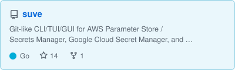
  </picture>
</a>
<a href="https://github.com/mpyw/feature">
  <picture>
    <source media="(prefers-color-scheme: dark)" srcset="cards/dark/mpyw__feature.svg">
    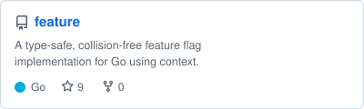
  </picture>
</a>
<a href="https://github.com/mpyw/sqlc-restruct">
  <picture>
    <source media="(prefers-color-scheme: dark)" srcset="cards/dark/mpyw__sqlc-restruct.svg">
    
  </picture>
</a>
<a href="https://github.com/mpyw/sql-http-proxy">
  <picture>
    <source media="(prefers-color-scheme: dark)" srcset="cards/dark/mpyw__sql-http-proxy.svg">
    
  </picture>
</a>
<a href="https://github.com/mpyw/bisql">
  <picture>
    <source media="(prefers-color-scheme: dark)" srcset="cards/dark/mpyw__bisql.svg">
    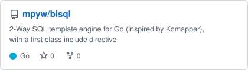
  </picture>
</a>
<a href="https://github.com/mpyw/ctxweaver">
  <picture>
    <source media="(prefers-color-scheme: dark)" srcset="cards/dark/mpyw__ctxweaver.svg">
    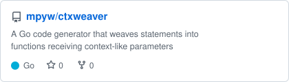
  </picture>
</a>
<a href="https://github.com/mpyw/goroutinectx">
  <picture>
    <source media="(prefers-color-scheme: dark)" srcset="cards/dark/mpyw__goroutinectx.svg">
    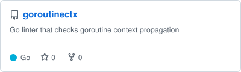
  </picture>
</a>
<a href="https://github.com/mpyw/gormreuse">
  <picture>
    <source media="(prefers-color-scheme: dark)" srcset="cards/dark/mpyw__gormreuse.svg">
    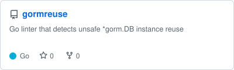
  </picture>
</a>
<a href="https://github.com/mpyw/zerologlintctx">
  <picture>
    <source media="(prefers-color-scheme: dark)" srcset="cards/dark/mpyw__zerologlintctx.svg">
    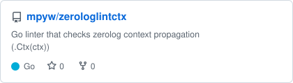
  </picture>
</a>

## Rust

<a href="https://github.com/mpyw/sea-query-common-like">
  <picture>
    <source media="(prefers-color-scheme: dark)" srcset="cards/dark/mpyw__sea-query-common-like.svg">
    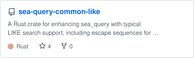
  </picture>
</a>
<a href="https://github.com/mpyw/donna-iro">
  <picture>
    <source media="(prefers-color-scheme: dark)" srcset="cards/dark/mpyw__donna-iro.svg">
    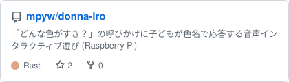
  </picture>
</a>

## TypeScript

<a href="https://github.com/mpyw/axios-case-converter">
  <picture>
    <source media="(prefers-color-scheme: dark)" srcset="cards/dark/mpyw__axios-case-converter.svg">
    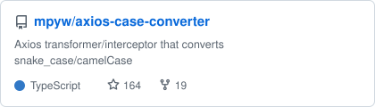
  </picture>
</a>
<a href="https://github.com/mpyw/FILTER_VALIDATE_EMAIL.js">
  <picture>
    <source media="(prefers-color-scheme: dark)" srcset="cards/dark/mpyw__FILTER_VALIDATE_EMAIL.js.svg">
    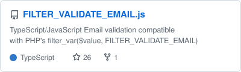
  </picture>
</a>

## PHP / Laravel

<a href="https://github.com/mpyw/laravel-cached-database-stickiness">
  <picture>
    <source media="(prefers-color-scheme: dark)" srcset="cards/dark/mpyw__laravel-cached-database-stickiness.svg">
    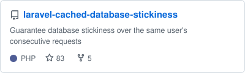
  </picture>
</a>
<a href="https://github.com/mpyw/comphar">
  <picture>
    <source media="(prefers-color-scheme: dark)" srcset="cards/dark/mpyw__comphar.svg">
    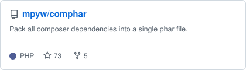
  </picture>
</a>
<a href="https://github.com/mpyw/laravel-database-advisory-lock">
  <picture>
    <source media="(prefers-color-scheme: dark)" srcset="cards/dark/mpyw__laravel-database-advisory-lock.svg">
    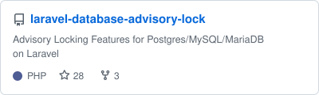
  </picture>
</a>
<a href="https://github.com/mpyw/EasyCrypt">
  <picture>
    <source media="(prefers-color-scheme: dark)" srcset="cards/dark/mpyw__EasyCrypt.svg">
    
  </picture>
</a>
<a href="https://github.com/mpyw/laravel-local-class-scope">
  <picture>
    <source media="(prefers-color-scheme: dark)" srcset="cards/dark/mpyw__laravel-local-class-scope.svg">
    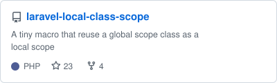
  </picture>
</a>
<a href="https://github.com/mpyw/null-auth">
  <picture>
    <source media="(prefers-color-scheme: dark)" srcset="cards/dark/mpyw__null-auth.svg">
    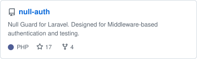
  </picture>
</a>
<a href="https://github.com/lampager/lampager-laravel">
  <picture>
    <source media="(prefers-color-scheme: dark)" srcset="cards/dark/lampager__lampager-laravel.svg">
    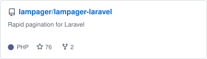
  </picture>
</a>
<a href="https://github.com/lampager/lampager">
  <picture>
    <source media="(prefers-color-scheme: dark)" srcset="cards/dark/lampager__lampager.svg">
    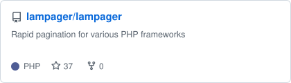
  </picture>
</a>
<a href="https://github.com/lampager/lampager-doctrine2">
  <picture>
    <source media="(prefers-color-scheme: dark)" srcset="cards/dark/lampager__lampager-doctrine2.svg">
    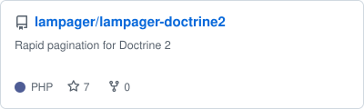
  </picture>
</a>
<a href="https://github.com/lampager/lampager-cakephp">
  <picture>
    <source media="(prefers-color-scheme: dark)" srcset="cards/dark/lampager__lampager-cakephp.svg">
    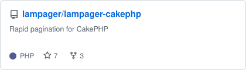
  </picture>
</a>

## Others

<a href="https://github.com/mpyw/hub-purge">
  <picture>
    <source media="(prefers-color-scheme: dark)" srcset="cards/dark/mpyw__hub-purge.svg">
    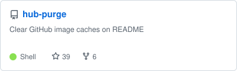
  </picture>
</a>

More introduced in [Repositories](https://github.com/mpyw?tab=repositories).

<!-- SHOWCASE:END -->
